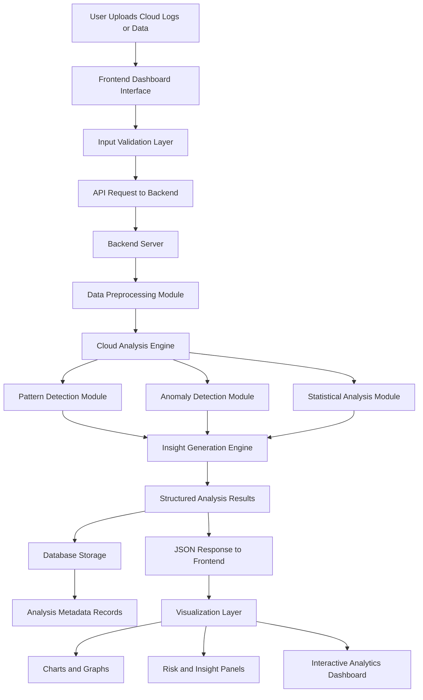

# ☁️ CloudSight-Analyzer – Intelligent Cloud Infrastructure Monitoring & Analysis

<div align="center">
  
</div>

<h3 align="center">
  
  
  
  
</h3>

<p align="center">
  <b>CloudSight-Analyzer is an AI-powered cloud infrastructure monitoring, optimization, and security analysis platform for multi-cloud environments.</b><br/>
  <i>Real-time visibility into AWS, Azure, GCP, and hybrid cloud deployments with predictive analytics and intelligent automation.</i>
</p>

---

## 📚 Table of Contents

- [Overview](#-overview)
- [Key Features](#-key-features)
- [Architecture](#-architecture)
- [Project Structure](#-project-structure)
- [Supported Cloud Platforms](#-supported-cloud-platforms)
- [Installation & Setup](#--installation--setup)
- [Configuration](#-configuration)
- [Usage Guide](#-usage-guide)
- [API Endpoints](#-api-endpoints)
- [Monitoring Dashboards](#-monitoring-dashboards)
- [Analytics & Reporting](#-analytics--reporting)
- [Performance Optimization](#-performance-optimization)
- [Roadmap](#-roadmap)
- [Contributing](#-contributing)
- [License](#-license)
- [Contact](#-contact)

---

## 🔎 Overview

Managing multi-cloud infrastructure is complex. Organizations struggle with:
- **Fragmented visibility** across multiple cloud providers
- **Cost inefficiency** due to unoptimized resources
- **Security blind spots** from misconfigured services
- **Performance degradation** without real-time monitoring
- **Compliance gaps** across hybrid environments

**CloudSight-Analyzer** solves these challenges by providing a **unified, intelligent platform** that:
- Aggregates metrics from AWS, Azure, and GCP in real-time
- Uses machine learning to detect anomalies and optimization opportunities
- Provides automated cost recommendations and compliance checking
- Offers predictive insights for capacity planning
- Enables proactive alerting and incident response

---

## ✨ Key Features

### 🌐 Multi-Cloud Integration
- **Native Support:** AWS, Azure, Google Cloud Platform, hybrid deployments
- **Unified Dashboard:** Single pane of glass for all cloud resources
- **Cross-Cloud Analytics:** Correlate metrics across providers
- **API Abstraction:** Unified API layer for heterogeneous cloud APIs

### 🧠 AI-Powered Analytics
- **Anomaly Detection:** ML models identify unusual patterns in resource usage
- **Predictive Analytics:** Forecast future resource demand and costs
- **Intelligent Alerting:** Context-aware alerts reduce noise
- **Root Cause Analysis:** AI-driven insights into performance issues

### 💰 Cost Optimization
- **Real-Time Cost Tracking:** Track spending across all cloud services
- **Right-Sizing Recommendations:** Identify over/under-provisioned resources
- **Reserved Instance Optimization:** Suggest best RIs/savings plans
- **Cost Anomaly Detection:** Alert when spending deviates from baseline
- **Chargeback & Allocation:** Attribute costs to business units/projects

### 🔐 Security & Compliance
- **Misconfig Detection:** Identify security group, IAM, and network issues
- **Compliance Scanning:** Check against CIS, NIST, ISO 27001, PCI-DSS
- **Vulnerability Assessment:** Detect exposed resources and weak policies
- **Audit Trail:** Complete logging of all configurations and changes
- **Auto-Remediation:** Automated fixes for common security issues

### 📊 Performance Monitoring
- **Real-Time Metrics:** CPU, memory, disk, network from all cloud instances
- **Custom Dashboards:** Build visualizations tailored to your needs
- **Distributed Tracing:** Trace requests across microservices
- **Log Aggregation:** Centralized logging from all cloud services
- **Alert Management:** Configurable thresholds and escalation policies

### ⚡ Operational Intelligence
- **Resource Inventory:** Comprehensive asset catalog across clouds
- **Dependency Mapping:** Visualize relationships between resources
- **Capacity Planning:** Forecast infrastructure needs
- **Scalability Analytics:** Identify bottlenecks in auto-scaling groups
- **Patch Management:** Track updates and compliance status

---

## 🏗️ Architecture

High-level architecture of CloudSight-Analyzer:



---

## 📁 Project Structure

Clean, modular organization for CloudSight-Analyzer:

```text
CloudSight-Analyzer/
├─ README.md
├─ LICENSE
├─ requirements.txt
├─ docker-compose.yml
├─ Dockerfile
│
├─ cloudsight_analyzer/
│  ├─ __init__.py
│  ├─ config.py              # Configuration management
│  ├─ utils/
│  │  ├─ logger.py
│  │  ├─ decorators.py
│  │  ├─ validators.py
│  │  └─ helpers.py
│  │
│  ├─ cloud/
│  │  ├─ base.py             # Abstract cloud provider class
│  │  ├─ aws_provider.py      # AWS integration
│  │  ├─ azure_provider.py    # Azure integration
│  │  ├─ gcp_provider.py      # GCP integration
│  │  └─ provider_factory.py  # Factory pattern for providers
│  │
│  ├─ collectors/
│  │  ├─ base_collector.py
│  │  ├─ metrics_collector.py # CPU, memory, disk, network
│  │  ├─ cost_collector.py    # Billing and cost data
│  │  ├─ security_collector.py # Security and compliance
│  │  └─ scheduler.py         # Orchestrate collections
│  │
│  ├─ storage/
│  │  ├─ timeseries_db.py    # InfluxDB / Prometheus
│  │  ├─ document_db.py      # MongoDB for metadata
│  │  ├─ cache.py            # Redis caching
│  │  └─ migrations.py       # Database versioning
│  │
│  ├─ analytics/
│  │  ├─ anomaly_detector.py # ML-based anomaly detection
│  │  ├─ cost_optimizer.py   # Cost analysis & recommendations
│  │  ├─ compliance_checker.py # CIS, NIST, ISO checks
│  │  ├─ predictor.py        # Time-series forecasting
│  │  └─ models/             # Pre-trained ML models (.pkl, .h5)
│  │
│  ├─ api/
│  │  ├─ main.py             # FastAPI application
│  │  ├─ schemas.py          # Pydantic models
│  │  ├─ routes/
│  │  │  ├─ clouds.py        # Cloud provider endpoints
│  │  │  ├─ resources.py     # Resource management
│  │  │  ├─ metrics.py       # Metrics & monitoring
│  │  │  ├─ costs.py         # Cost analysis
│  │  │  ├─ security.py      # Security & compliance
│  │  │  ├─ alerts.py        # Alert management
│  │  │  ├─ reports.py       # Report generation
│  │  │  └─ health.py        # System health checks
│  │  │
│  │  └─ auth/
│  │     ├─ jwt_handler.py
│  │     └─ permissions.py
│  │
│  ├─ integrations/
│  │  ├─ slack_notifier.py
│  │  ├─ teams_notifier.py
│  │  ├─ email_sender.py
│  │  ├─ webhook_dispatcher.py
│  │  └─ siem_connector.py  # SIEM (Splunk, ELK) integration
│  │
│  └─ dashboard/             # (Optional) Streamlit/React frontend
│     └─ app.py
│
├─ tests/
│  ├─ unit/
│  │  ├─ test_aws_provider.py
│  │  ├─ test_metrics_collector.py
│  │  ├─ test_anomaly_detector.py
│  │  └─ test_cost_optimizer.py
│  │
│  └─ integration/
│     └─ test_api_endpoints.py
│
├─ experiments/
│  ├─ notebooks/             # Jupyter exploration
│  │  ├─ cost_analysis.ipynb
│  │  ├─ anomaly_tuning.ipynb
│  │  └─ compliance_audit.ipynb
│  │
│  └─ results/               # Experiment reports
│
└─ data/
   ├─ raw/                   # Raw cloud API responses (ignored)
   ├─ processed/             # Cleaned & enriched data
   └─ models/                # ML model artifacts
```

---

## ☁️ Supported Cloud Platforms

### Amazon Web Services (AWS)
- **Services Monitored:** EC2, RDS, S3, Lambda, DynamoDB, ECS, EKS, ALB/NLB, CloudFront, and 200+
- **Metrics:** CPU, memory, disk I/O, network, application-specific
- **Cost:** Track EC2, RDS, S3, Lambda, compute costs with detailed breakdowns
- **Security:** IAM policies, security groups, VPC configuration, S3 bucket policies
- **Compliance:** CIS AWS Foundations Benchmark, PCI-DSS, HIPAA, SOC 2

### Microsoft Azure
- **Services Monitored:** VMs, App Services, SQL Database, Cosmos DB, AKS, Functions, Storage
- **Metrics:** CPU %, available memory, disk I/O, network throughput
- **Cost:** Azure consumption-based billing analysis, reserved instance optimization
- **Security:** Network security groups, IAM roles, encryption status, key vault audit
- **Compliance:** CIS Azure Foundations, ISO 27001, NIST

### Google Cloud Platform (GCP)
- **Services Monitored:** Compute Engine, GKE, Cloud SQL, Firestore, Cloud Storage, Cloud Functions
- **Metrics:** VM metrics via Monitoring API, application performance
- **Cost:** BigQuery-based cost analysis, commitment discounts
- **Security:** IAM bindings, VPC firewall rules, bucket ACLs
- **Compliance:** CIS GCP Foundations, PCI-DSS, ISO compliance tracking

### Hybrid & Multi-Cloud
- **On-Premises Integration:** Connect physical servers and VMs
- **Cross-Cloud Analytics:** Correlate metrics and costs across providers
- **Unified Billing:** Single pane of glass for all infrastructure costs

---

## 🚀 Installation & Setup

### Prerequisites

- Python 3.9+
- PostgreSQL 12+ or MongoDB for metadata storage
- InfluxDB 2.0+ or Prometheus for time-series metrics
- Redis 6.0+ for caching
- Docker and Docker Compose (recommended)
- Cloud provider credentials (AWS, Azure, GCP)

### Option 1: Docker Installation (Recommended)

```bash
# Clone the repository
git clone https://github.com/LoganthP/CloudSight-Analyzer.git
cd CloudSight-Analyzer

# Create environment configuration
cp .env.example .env
# Edit .env with your cloud credentials and API keys

# Build and start all services
docker-compose up -d

# Verify services are running
docker-compose ps

# View logs
docker-compose logs -f cloudsight-api

# Access the application
# API: http://localhost:8000
# Swagger Docs: http://localhost:8000/docs
# Grafana Dashboard: http://localhost:3000 (admin/admin)
```

### Option 2: Manual Installation

#### Backend Setup

```bash
# Clone repository
git clone https://github.com/LoganthP/CloudSight-Analyzer.git
cd CloudSight-Analyzer

# Create virtual environment
python -m venv venv
source venv/bin/activate  # On Windows: venv\Scripts\activate

# Install dependencies
pip install -r requirements.txt

# Set up environment variables
cp .env.example .env
# Edit .env with your configuration

# Start the API server
uvicorn cloudsight_analyzer.api.main:app --host 0.0.0.0 --port 8000 --reload
# API will be available at http://localhost:8000
```

#### Database Setup

```bash
# PostgreSQL for metadata
sudo apt-get install postgresql postgresql-contrib
createdb cloudsight_analyzer
createuser cloudsight_user --pwprompt

# InfluxDB for time-series metrics
wget -qO- https://repos.influxdata.com/influxdb.key | sudo apt-key add -
sudo apt-get update
sudo apt-get install influxdb2

# Redis for caching
sudo apt-get install redis-server

# Start services
sudo systemctl start postgresql influxdb redis-server
```

---

## ⚙️ Configuration

### Environment Variables (.env)

```env
# Application
APP_NAME=CloudSight-Analyzer
APP_ENV=production
DEBUG=False
SECRET_KEY=your-secret-key-here

# Database
POSTGRES_HOST=localhost
POSTGRES_PORT=5432
POSTGRES_USER=cloudsight_user
POSTGRES_PASSWORD=your_password
POSTGRES_DB=cloudsight_analyzer

# Time-Series Database
INFLUXDB_URL=http://localhost:8086
INFLUXDB_ORG=CloudSight
INFLUXDB_BUCKET=cloud-metrics
INFLUXDB_TOKEN=your-influxdb-token

# Redis
REDIS_HOST=localhost
REDIS_PORT=6379
REDIS_DB=0

# AWS Configuration
AWS_ACCESS_KEY_ID=your_access_key
AWS_SECRET_ACCESS_KEY=your_secret_key
AWS_REGIONS=us-east-1,us-west-2,eu-west-1

# Azure Configuration
AZURE_TENANT_ID=your_tenant_id
AZURE_CLIENT_ID=your_client_id
AZURE_CLIENT_SECRET=your_client_secret
AZURE_SUBSCRIPTION_ID=your_subscription_id

# GCP Configuration
GOOGLE_APPLICATION_CREDENTIALS=/path/to/service-account.json
GCP_PROJECT_ID=your_project_id

# Notification Services
SLACK_WEBHOOK_URL=https://hooks.slack.com/services/...
EMAIL_HOST=smtp.gmail.com
EMAIL_PORT=587
EMAIL_USER=your-email@gmail.com
EMAIL_PASSWORD=your-app-password

# API Keys
EXTERNAL_API_KEY=your_api_key_for_third_party_services

# Collection Intervals (seconds)
METRICS_COLLECTION_INTERVAL=300  # 5 minutes
COST_COLLECTION_INTERVAL=3600    # 1 hour
SECURITY_SCAN_INTERVAL=86400     # 24 hours
```

### Cloud Provider Configuration

#### AWS

```bash
# IAM Policy required for CloudSight-Analyzer
{
  "Version": "2012-10-17",
  "Statement": [
    {
      "Effect": "Allow",
      "Action": [
        "ec2:Describe*",
        "rds:Describe*",
        "s3:ListBucket",
        "s3:GetBucketPolicy",
        "ce:GetCostAndUsage",
        "cloudwatch:GetMetricStatistics",
        "iam:Get*",
        "iam:List*"
      ],
      "Resource": "*"
    }
  ]
}
```

#### Azure

```bash
# Required roles
az role assignment create --assignee <app-id> \
  --role "Monitoring Reader" \
  --scope /subscriptions/<subscription-id>
```

#### GCP

```bash
# Service account permissions
gcloud projects add-iam-policy-binding <project-id> \
  --member=serviceAccount:<service-account@project.iam.gserviceaccount.com> \
  --role=roles/monitoring.viewer
```

---

## 📖 Usage Guide

### 1. Register Cloud Provider

```bash
curl -X POST "http://localhost:8000/api/v1/clouds" \
  -H "Content-Type: application/json" \
  -H "Authorization: Bearer YOUR_TOKEN" \
  -d '{
    "provider": "aws",
    "name": "Production AWS",
    "credentials": {
      "access_key_id": "AKIA...",
      "secret_access_key": "..."
    },
    "regions": ["us-east-1", "eu-west-1"]
  }'
```

### 2. Fetch Real-Time Metrics

```python
from cloudsight_analyzer.api.client import CloudSightClient

client = CloudSightClient(api_url="http://localhost:8000", api_key="your_api_key")

# Get EC2 instance metrics
metrics = client.get_metrics(
    cloud_provider="aws",
    resource_type="ec2",
    time_range=("2025-11-01", "2025-11-30"),
    aggregation="hourly"
)
print(metrics)
```

### 3. Cost Analysis

```bash
curl "http://localhost:8000/api/v1/costs/analysis" \
  -H "Authorization: Bearer YOUR_TOKEN" \
  -d '{
    "cloud": "aws",
    "start_date": "2025-11-01",
    "end_date": "2025-11-30",
    "group_by": "service"
  }'
```

### 4. Security Compliance Check

```bash
curl "http://localhost:8000/api/v1/security/scan" \
  -H "Authorization: Bearer YOUR_TOKEN" \
  -X POST \
  -d '{
    "cloud": "azure",
    "framework": "cis",
    "severity": "high"
  }'
```

### 5. Generate Reports

```bash
curl "http://localhost:8000/api/v1/reports/generate" \
  -H "Authorization: Bearer YOUR_TOKEN" \
  -X POST \
  -d '{
    "report_type": "executive_summary",
    "period": "monthly",
    "include_sections": ["costs", "security", "performance"]
  }' \
  -o report.pdf
```

---

## 📊 API Endpoints

| Method | Endpoint | Description |
|--------|----------|-------------|
| **GET** | `/api/v1/clouds` | List configured clouds |
| **POST** | `/api/v1/clouds` | Register new cloud provider |
| **GET** | `/api/v1/clouds/{id}/resources` | List cloud resources |
| **GET** | `/api/v1/metrics` | Fetch time-series metrics |
| **POST** | `/api/v1/metrics/search` | Advanced metric search |
| **GET** | `/api/v1/costs/summary` | Cost overview |
| **GET** | `/api/v1/costs/recommendations` | Optimization recommendations |
| **POST** | `/api/v1/security/scan` | Run security scan |
| **GET** | `/api/v1/compliance/status` | Compliance status |
| **POST** | `/api/v1/alerts/configure` | Set up alerts |
| **GET** | `/api/v1/reports/list` | List available reports |
| **POST** | `/api/v1/reports/generate` | Generate custom report |
| **GET** | `/api/v1/health` | System health check |

---

## 📊 Monitoring Dashboards

### Grafana Integration

CloudSight-Analyzer includes pre-built Grafana dashboards:

- **Cloud Overview:** High-level metrics from all providers
- **Cost Analytics:** Spending trends, forecasting, recommendations
- **Security Posture:** Compliance status, vulnerabilities, misconfigurations
- **Performance Metrics:** CPU, memory, disk, network utilization
- **Capacity Planning:** Resource forecasts and trends

### Custom Dashboards

```bash
# Access Grafana
http://localhost:3000

# Default credentials
username: admin
password: admin

# Import CloudSight dashboards from:
/grafana/dashboards/
```

---

## 📈 Analytics & Reporting

### Available Reports

1. **Executive Summary**
   - High-level KPIs
   - Cost overview and trends
   - Security posture
   - Top recommendations

2. **Cost Analysis**
   - Detailed cost breakdown by service
   - Month-over-month comparison
   - Right-sizing opportunities
   - Reserved instance savings

3. **Security & Compliance**
   - Compliance status against frameworks
   - Vulnerabilities and misconfigurations
   - Remediation status
   - Audit trail

4. **Performance Report**
   - Resource utilization metrics
   - Bottleneck identification
   - Scalability analysis
   - Recommendations

---

## ⚡ Performance Optimization

### Scaling Considerations

```yaml
# docker-compose.yml - Production configuration
version: '3.9'
services:
  cloudsight-api:
    image: cloudsight-analyzer:latest
    deploy:
      replicas: 3
      resources:
        limits:
          cpus: '2'
          memory: 4G
    environment:
      - WORKERS=4
      - DATABASE_POOL_SIZE=20

  influxdb:
    image: influxdb:2.7
    volumes:
      - influxdb-storage:/var/lib/influxdb2
    environment:
      - INFLUXDB_DB_RETENTION=30d

  postgres:
    image: postgres:15-alpine
    environment:
      - POSTGRES_MAX_CONNECTIONS=200

  redis:
    image: redis:7-alpine
    command: redis-server --maxmemory 2gb --maxmemory-policy allkeys-lru
```

### Query Optimization

- **Caching:** Redis caches frequently accessed metrics
- **Batch Processing:** Bulk inserts for time-series data
- **Index Strategy:** Optimized database indexes for common queries
- **Aggregation:** Pre-computed hourly/daily summaries

---

## 🛤️ Roadmap

- [x] Multi-cloud data collection
- [x] Real-time metrics aggregation
- [x] Cost analysis & optimization
- [x] Security compliance scanning
- [x] REST API & authentication
- [ ] ML-based anomaly detection (advanced)
- [ ] Predictive capacity planning
- [ ] Auto-remediation for common issues
- [ ] Mobile application
- [ ] Terraform/IaC integration
- [ ] Kubernetes cluster monitoring
- [ ] FinOps automation

---

## 🤝 Contributing

1. Fork & branch: `git checkout -b feature/your-feature`
2. Code with style: Follow PEP8, add type hints, docstrings
3. Add tests: `pytest tests/`
4. Commit: Clear, descriptive messages
5. Push & PR: Reference issues, add screenshots

---


<div align="center">


**Made with ☁️ for Multi-Cloud Intelligence**

[↑ Back to Top](#%EF%B8%8F-cloudsight-analyzer--intelligent-cloud-infrastructure-monitoring--analysis)

</div>
