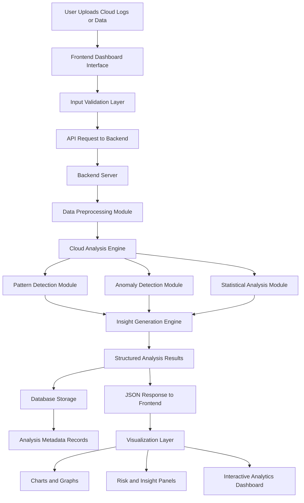

<h1 align="center">☁️ CloudSight-Analyzer – Intelligent Cloud Infrastructure Monitoring & Analysis</h1>

<div align="center">
  
</div>

<h3 align="center">
  
  
  
  
</h3>

<p align="center">
  <b>CloudSight-Analyzer is an AI-powered cloud infrastructure monitoring, optimization, and security analysis platform for multi-cloud environments.</b><br/>
  <i>Real-time visibility into AWS, Azure, GCP, and hybrid cloud deployments with predictive analytics and intelligent automation.</i>
</p>

---

## 🔎 Overview

Managing multi-cloud infrastructure is complex. Organizations struggle with:
- **Fragmented visibility** across multiple cloud providers
- **Cost inefficiency** due to unoptimized resources
- **Security blind spots** from misconfigured services
- **Performance degradation** without real-time monitoring
- **Compliance gaps** across hybrid environments

**CloudSight-Analyzer** solves these challenges by providing a **unified, intelligent platform** that:
- Aggregates metrics from AWS, Azure, and GCP in real-time
- Uses machine learning to detect anomalies and optimization opportunities
- Provides automated cost recommendations and compliance checking
- Offers predictive insights for capacity planning
- Enables proactive alerting and incident response

---

## ✨ Key Features

### 🌐 Multi-Cloud Integration
- **Native Support:** AWS, Azure, Google Cloud Platform, hybrid deployments
- **Unified Dashboard:** Single pane of glass for all cloud resources
- **Cross-Cloud Analytics:** Correlate metrics across providers
- **API Abstraction:** Unified API layer for heterogeneous cloud APIs

### 🧠 AI-Powered Analytics
- **Anomaly Detection:** ML models identify unusual patterns in resource usage
- **Predictive Analytics:** Forecast future resource demand and costs
- **Intelligent Alerting:** Context-aware alerts reduce noise
- **Root Cause Analysis:** AI-driven insights into performance issues

### 💰 Cost Optimization
- **Real-Time Cost Tracking:** Track spending across all cloud services
- **Right-Sizing Recommendations:** Identify over/under-provisioned resources
- **Reserved Instance Optimization:** Suggest best RIs/savings plans
- **Cost Anomaly Detection:** Alert when spending deviates from baseline
- **Chargeback & Allocation:** Attribute costs to business units/projects

### 🔐 Security & Compliance
- **Misconfig Detection:** Identify security group, IAM, and network issues
- **Compliance Scanning:** Check against CIS, NIST, ISO 27001, PCI-DSS
- **Vulnerability Assessment:** Detect exposed resources and weak policies
- **Audit Trail:** Complete logging of all configurations and changes
- **Auto-Remediation:** Automated fixes for common security issues

### 📊 Performance Monitoring
- **Real-Time Metrics:** CPU, memory, disk, network from all cloud instances
- **Custom Dashboards:** Build visualizations tailored to your needs
- **Distributed Tracing:** Trace requests across microservices
- **Log Aggregation:** Centralized logging from all cloud services
- **Alert Management:** Configurable thresholds and escalation policies

### ⚡ Operational Intelligence
- **Resource Inventory:** Comprehensive asset catalog across clouds
- **Dependency Mapping:** Visualize relationships between resources
- **Capacity Planning:** Forecast infrastructure needs
- **Scalability Analytics:** Identify bottlenecks in auto-scaling groups
- **Patch Management:** Track updates and compliance status

---

## 🏗️ Architecture

High-level architecture of CloudSight-Analyzer:



---

## 📁 Project Structure

Clean, modular organization for CloudSight-Analyzer:

```text
CloudSight-Analyzer/
├─ README.md
├─ LICENSE
├─ requirements.txt
├─ docker-compose.yml
├─ Dockerfile
│
├─ cloudsight_analyzer/
│  ├─ __init__.py
│  ├─ config.py              # Configuration management
│  ├─ utils/
│  │  ├─ logger.py
│  │  ├─ decorators.py
│  │  ├─ validators.py
│  │  └─ helpers.py
│  │
│  ├─ cloud/
│  │  ├─ base.py             # Abstract cloud provider class
│  │  ├─ aws_provider.py      # AWS integration
│  │  ├─ azure_provider.py    # Azure integration
│  │  ├─ gcp_provider.py      # GCP integration
│  │  └─ provider_factory.py  # Factory pattern for providers
│  │
│  ├─ collectors/
│  │  ├─ base_collector.py
│  │  ├─ metrics_collector.py # CPU, memory, disk, network
│  │  ├─ cost_collector.py    # Billing and cost data
│  │  ├─ security_collector.py # Security and compliance
│  │  └─ scheduler.py         # Orchestrate collections
│  │
│  ├─ storage/
│  │  ├─ timeseries_db.py    # InfluxDB / Prometheus
│  │  ├─ document_db.py      # MongoDB for metadata
│  │  ├─ cache.py            # Redis caching
│  │  └─ migrations.py       # Database versioning
│  │
│  ├─ analytics/
│  │  ├─ anomaly_detector.py # ML-based anomaly detection
│  │  ├─ cost_optimizer.py   # Cost analysis & recommendations
│  │  ├─ compliance_checker.py # CIS, NIST, ISO checks
│  │  ├─ predictor.py        # Time-series forecasting
│  │  └─ models/             # Pre-trained ML models (.pkl, .h5)
│  │
│  ├─ api/
│  │  ├─ main.py             # FastAPI application
│  │  ├─ schemas.py          # Pydantic models
│  │  ├─ routes/
│  │  │  ├─ clouds.py        # Cloud provider endpoints
│  │  │  ├─ resources.py     # Resource management
│  │  │  ├─ metrics.py       # Metrics & monitoring
│  │  │  ├─ costs.py         # Cost analysis
│  │  │  ├─ security.py      # Security & compliance
│  │  │  ├─ alerts.py        # Alert management
│  │  │  ├─ reports.py       # Report generation
│  │  │  └─ health.py        # System health checks
│  │  │
│  │  └─ auth/
│  │     ├─ jwt_handler.py
│  │     └─ permissions.py
│  │
│  ├─ integrations/
│  │  ├─ slack_notifier.py
│  │  ├─ teams_notifier.py
│  │  ├─ email_sender.py
│  │  ├─ webhook_dispatcher.py
│  │  └─ siem_connector.py  # SIEM (Splunk, ELK) integration
│  │
│  └─ dashboard/             # (Optional) Streamlit/React frontend
│     └─ app.py
│
├─ tests/
│  ├─ unit/
│  │  ├─ test_aws_provider.py
│  │  ├─ test_metrics_collector.py
│  │  ├─ test_anomaly_detector.py
│  │  └─ test_cost_optimizer.py
│  │
│  └─ integration/
│     └─ test_api_endpoints.py
│
├─ experiments/
│  ├─ notebooks/             # Jupyter exploration
│  │  ├─ cost_analysis.ipynb
│  │  ├─ anomaly_tuning.ipynb
│  │  └─ compliance_audit.ipynb
│  │
│  └─ results/               # Experiment reports
│
└─ data/
   ├─ raw/                   # Raw cloud API responses (ignored)
   ├─ processed/             # Cleaned & enriched data
   └─ models/                # ML model artifacts
```

---

## ☁️ Supported Cloud Platforms

### Amazon Web Services (AWS)
- **Services Monitored:** EC2, RDS, S3, Lambda, DynamoDB, ECS, EKS, ALB/NLB, CloudFront, and 200+
- **Metrics:** CPU, memory, disk I/O, network, application-specific
- **Cost:** Track EC2, RDS, S3, Lambda, compute costs with detailed breakdowns
- **Security:** IAM policies, security groups, VPC configuration, S3 bucket policies
- **Compliance:** CIS AWS Foundations Benchmark, PCI-DSS, HIPAA, SOC 2

### Microsoft Azure
- **Services Monitored:** VMs, App Services, SQL Database, Cosmos DB, AKS, Functions, Storage
- **Metrics:** CPU %, available memory, disk I/O, network throughput
- **Cost:** Azure consumption-based billing analysis, reserved instance optimization
- **Security:** Network security groups, IAM roles, encryption status, key vault audit
- **Compliance:** CIS Azure Foundations, ISO 27001, NIST

### Google Cloud Platform (GCP)
- **Services Monitored:** Compute Engine, GKE, Cloud SQL, Firestore, Cloud Storage, Cloud Functions
- **Metrics:** VM metrics via Monitoring API, application performance
- **Cost:** BigQuery-based cost analysis, commitment discounts
- **Security:** IAM bindings, VPC firewall rules, bucket ACLs
- **Compliance:** CIS GCP Foundations, PCI-DSS, ISO compliance tracking

### Hybrid & Multi-Cloud
- **On-Premises Integration:** Connect physical servers and VMs
- **Cross-Cloud Analytics:** Correlate metrics and costs across providers
- **Unified Billing:** Single pane of glass for all infrastructure costs

---

## 🚀 Installation & Setup

### 📋 Prerequisites

Make sure the following are installed:

- **Node.js** (v18 or later recommended)
- **npm** (included with Node.js)
- **Git** (optional, for cloning the repository)
- **Docker & Docker Compose** (optional, for containerized deployment)

---

### 📦 Installation

Clone the repository and install all required dependencies.

```bash
git clone <repository-url>
cd CloudSight-Analyzer
npm install
```

> **Note:** Since this is a unified full-stack project, the root `package.json` installs both frontend and backend dependencies.

---

### ▶️ Run in Development Mode

Start both the **React frontend** and **Express backend** simultaneously.

```bash
npm run dev
```

### Running Services

| Service | URL |
|---------|-----|
| 🌐 Frontend (Vite) | http://localhost:5173 |
| ⚙️ Backend API | http://localhost:3000 |
| ❤️ Health Check | http://localhost:3000/api/health |

The development server includes:

- ⚡ Hot Module Replacement (HMR) for React
- 🔄 Automatic backend restart with Nodemon
- 🚀 Concurrent frontend and backend execution

---

### 🏗️ Build for Production

Generate an optimized production build.

```bash
npm run build
```

Preview the production build locally:

```bash
npm run preview
```

---

### ⚙️ Environment Variables

The application works out of the box with sensible defaults.

Create a `.env` file in the project root if you wish to customize the configuration.

```env
PORT=3000
API_URL=/api
```

| Variable | Default | Description |
|----------|---------|-------------|
| `PORT` | `3000` | Backend server port |
| `API_URL` | `/api` | Base API endpoint |

---

### 🐳 Running with Docker

Build and start the application using Docker Compose.

```bash
docker-compose up -d --build
```

---

### 🌍 Access the Application

After the containers have started:

| Service | URL |
|---------|-----|
| 🌐 Frontend Dashboard | http://localhost:5173 |
| ⚙️ Backend API | http://localhost:3000 |
| ❤️ API Health Check | http://localhost:3000/api/health |

---

### 📜 View Container Logs

Monitor application logs in real time.

```bash
docker-compose logs -f
```

---

### 🛑 Stop the Containers

```bash
docker-compose down
```

---

### 🔄 Rebuild Containers

If dependencies or configuration change:

```bash
docker-compose up -d --build
```

---

### 📁 Project Workflow

```text
Clone Repository
        │
        ▼
   npm install
        │
        ▼
    npm run dev
        │
        ├────────► Frontend → http://localhost:5173
        │
        └────────► Backend  → http://localhost:3000
                           │
                           └── Health Check → /api/health
```
---

## 📊 API Endpoints

| Method | Endpoint | Description |
|--------|----------|-------------|
| **GET** | `/api/v1/clouds` | List configured clouds |
| **POST** | `/api/v1/clouds` | Register new cloud provider |
| **GET** | `/api/v1/clouds/{id}/resources` | List cloud resources |
| **GET** | `/api/v1/metrics` | Fetch time-series metrics |
| **POST** | `/api/v1/metrics/search` | Advanced metric search |
| **GET** | `/api/v1/costs/summary` | Cost overview |
| **GET** | `/api/v1/costs/recommendations` | Optimization recommendations |
| **POST** | `/api/v1/security/scan` | Run security scan |
| **GET** | `/api/v1/compliance/status` | Compliance status |
| **POST** | `/api/v1/alerts/configure` | Set up alerts |
| **GET** | `/api/v1/reports/list` | List available reports |
| **POST** | `/api/v1/reports/generate` | Generate custom report |
| **GET** | `/api/v1/health` | System health check |

---

## 📊 Monitoring Dashboards

### Grafana Integration

CloudSight-Analyzer includes pre-built Grafana dashboards:

- **Cloud Overview:** High-level metrics from all providers
- **Cost Analytics:** Spending trends, forecasting, recommendations
- **Security Posture:** Compliance status, vulnerabilities, misconfigurations
- **Performance Metrics:** CPU, memory, disk, network utilization
- **Capacity Planning:** Resource forecasts and trends

### Custom Dashboards

```bash
# Access Grafana
http://localhost:3000

# Default credentials
username: admin
password: admin

# Import CloudSight dashboards from:
/grafana/dashboards/
```
---
## 🛠️ Tech Stack

| Category | Technologies |
|----------|--------------|
| **Core Language** | TypeScript |
| **Frontend Framework** | React 18 |
| **Build Tool** | Vite |
| **Routing** | React Router (`react-router-dom`) |
| **Styling** | Tailwind CSS |
| **UI Components** | shadcn/ui, Radix UI |
| **Icons** | Lucide React |
| **Theme Management** | Next Themes |
| **State Management & Data Fetching** | SWR |
| **Forms** | React Hook Form |
| **Validation** | Zod, @hookform/resolvers |
| **Charts & Analytics** | Recharts |
| **Animations** | Framer Motion |
| **Carousel** | Embla Carousel |
| **Date & Calendar** | date-fns, React Day Picker |
| **Backend Runtime** | Node.js |
| **Backend Framework** | Express.js |
| **Development Server** | tsx, Nodemon |
| **Middleware** | CORS, Dotenv |
| **Development Tools** | Concurrently |
| **Code Quality** | ESLint |
| **CSS Processing** | PostCSS, Autoprefixer |
| **Package Manager** | npm |
| **Version Control** | Git, GitHub |

---
---

## 📈 Analytics & Reporting

### Available Reports

1. **Executive Summary**
   - High-level KPIs
   - Cost overview and trends
   - Security posture
   - Top recommendations

2. **Cost Analysis**
   - Detailed cost breakdown by service
   - Month-over-month comparison
   - Right-sizing opportunities
   - Reserved instance savings

3. **Security & Compliance**
   - Compliance status against frameworks
   - Vulnerabilities and misconfigurations
   - Remediation status
   - Audit trail

4. **Performance Report**
   - Resource utilization metrics
   - Bottleneck identification
   - Scalability analysis
   - Recommendations

---

## ⚡ Performance Optimization

### Scaling Considerations

```yaml
# docker-compose.yml - Production configuration
version: '3.9'
services:
  cloudsight-api:
    image: cloudsight-analyzer:latest
    deploy:
      replicas: 3
      resources:
        limits:
          cpus: '2'
          memory: 4G
    environment:
      - WORKERS=4
      - DATABASE_POOL_SIZE=20

  influxdb:
    image: influxdb:2.7
    volumes:
      - influxdb-storage:/var/lib/influxdb2
    environment:
      - INFLUXDB_DB_RETENTION=30d

  postgres:
    image: postgres:15-alpine
    environment:
      - POSTGRES_MAX_CONNECTIONS=200

  redis:
    image: redis:7-alpine
    command: redis-server --maxmemory 2gb --maxmemory-policy allkeys-lru
```

### Query Optimization

- **Caching:** Redis caches frequently accessed metrics
- **Batch Processing:** Bulk inserts for time-series data
- **Index Strategy:** Optimized database indexes for common queries
- **Aggregation:** Pre-computed hourly/daily summaries
